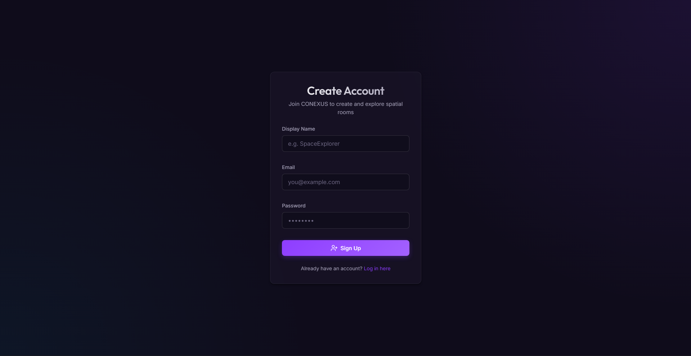
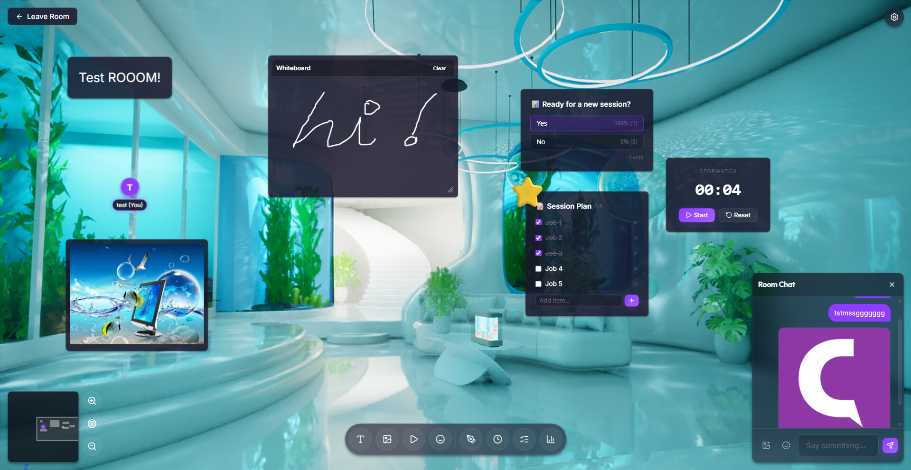
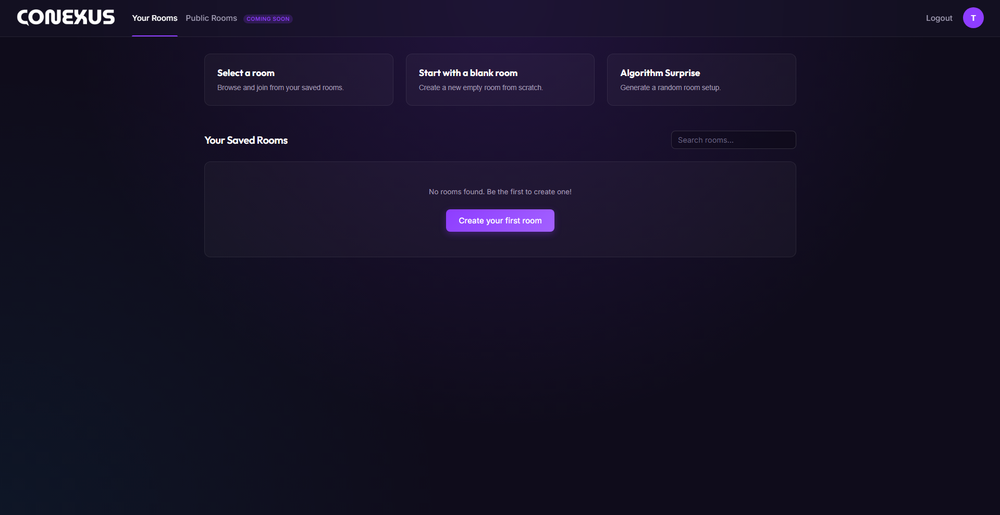
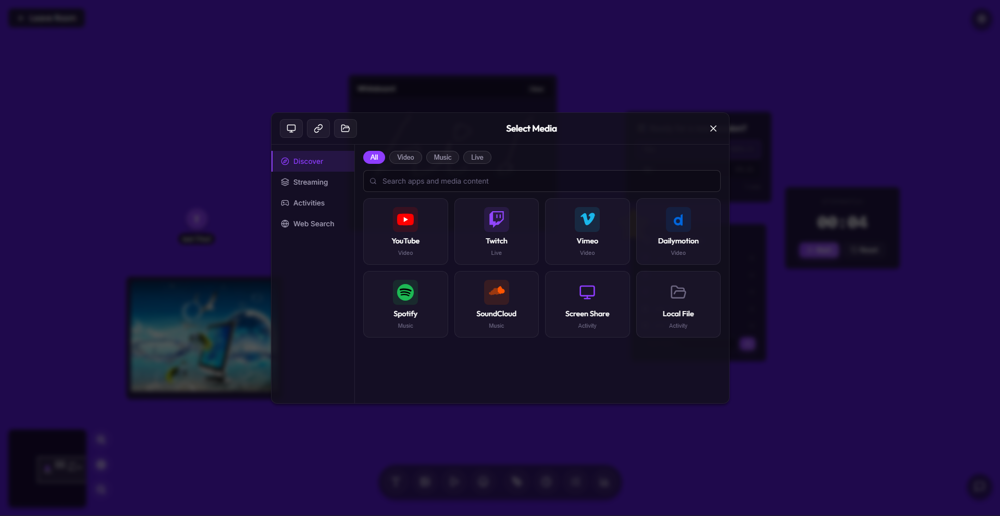
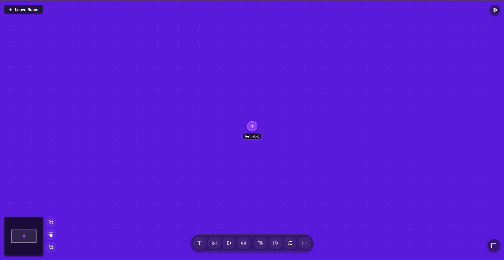
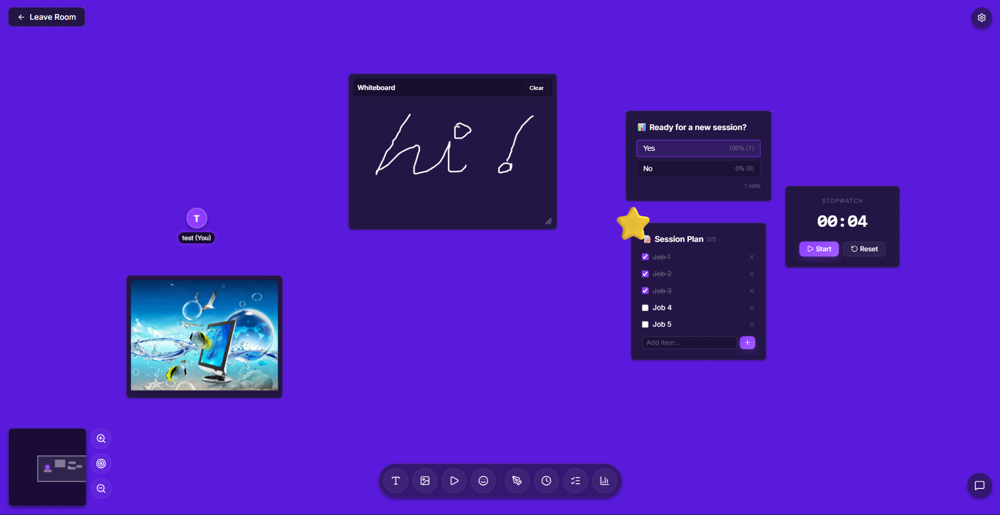
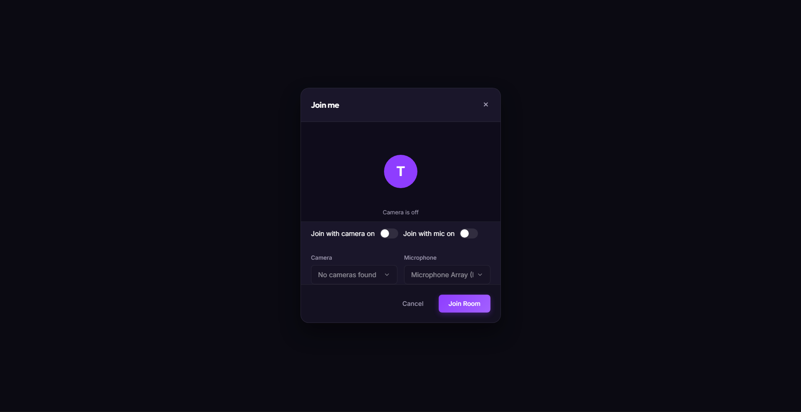
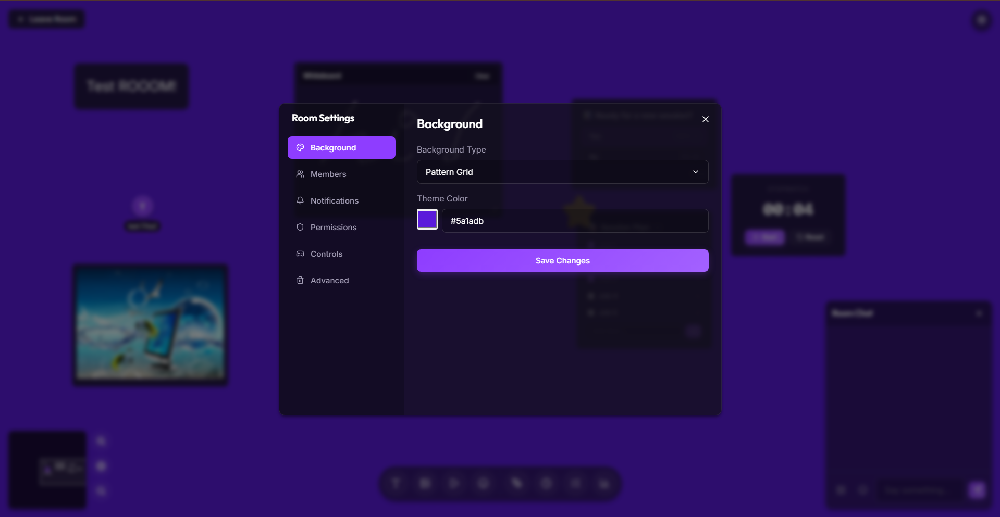

# 🔗 CONEXUS

**A real-time collaborative virtual room platform**

TypeScript • React • Socket.IO • Express • MIT License

Create shared virtual rooms, embed media, collaborate in real-time with cursors, whiteboards, polls, and more.

---

## 🚀 Live Preview

---

## ✨ Features

| Feature | Description |
|---|---|
| 🎥 Media Embedding | YouTube, Twitch, Spotify, SoundCloud support |
| 🖱️ Live Cursors | Real-time user movement |
| 📹 Screen Sharing | WebRTC peer-to-peer streaming |
| 🎨 Whiteboard | Collaborative drawing canvas |
| 📊 Polls | Live voting system |
| ✅ Todo Lists | Shared tasks |
| ⏱️ Timers | Synced countdowns |
| 💬 Chat | Persistent room chat |
| 🗺️ Minimap | Navigation support |
| 🔐 Auth | JWT authentication |
| ⚙️ Settings | Room configuration |

---

## 🖼️ Product Showcase

### 🧠 Main Interface

### 💬 Chat

### 🖱️ Cursors

### 🎥 Media

### 🎨 Whiteboard

### 📊 Tools

### 🧩 Controls

### ⚙️ Settings

---

## 🏗️ Architecture

<pre>
conexus/
├── apps/
│   ├── server/
│   │   ├── src/
│   │   │   ├── auth/
│   │   │   ├── middleware/
│   │   │   ├── rooms/
│   │   │   ├── routes/
│   │   │   ├── socket/
│   │   │   ├── types/
│   │   │   ├── db.ts
│   │   │   └── index.ts
│   │   └── uploads/
│   │
│   └── web/
│       └── src/
│           ├── components/
│           ├── hooks/
│           ├── lib/
│           ├── pages/
│           └── store/
│
├── packages/
│   └── shared-types/
│
├── tsconfig.base.json
└── package.json
</pre>

---

## 🚀 Getting Started

bash:
git clone https://github.com/YOUR_USERNAME/conexus.git
cd conexus
npm install
npm run dev

🛡️ Security
JWT authentication
bcrypt hashing
Environment-based secrets
Input validation
SQLite WAL safety
🤝 Contributing

Fork → Branch → Commit → PR

📝 License

MIT License

Built with ❤️ as a portfolio project

 
